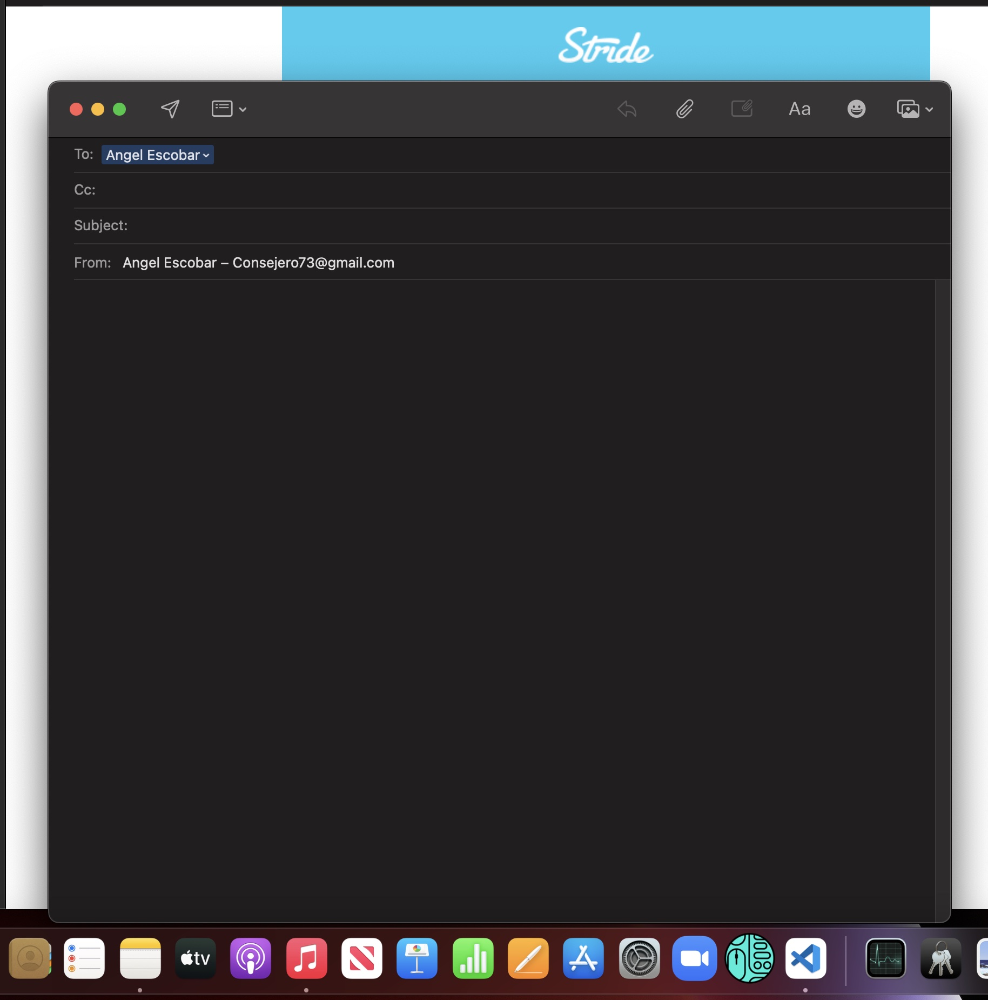
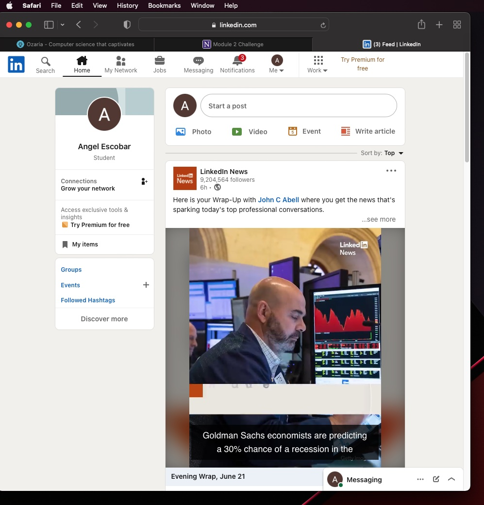

# 02-week-Portfolio

Accept Criteria

GIVEN I need to sample a potential employee's previous work
WHEN I load their portfolio
THEN I am presented with the developer's name, a recent photo or avatar, and links to sections about them, their work, and how to contact them
WHEN I click one of the links in the navigation
THEN the UI scrolls to the corresponding section
WHEN I click on the link to the section about their work
THEN the UI scrolls to a section with titled images of the developer's applications
WHEN I am presented with the developer's first application
THEN that application's image should be larger in size than the others
WHEN I click on the images of the applications
THEN I am taken to that deployed application
WHEN I resize the page or view the site on various screens and devices
THEN I am presented with a responsive layout that adapts to my viewport

In the following project you will find a portolio that has function "clicks" when clicked upon. The first list items if clicked on will take you to the corresponding section on the page.

Following that, clicking under Work, the words should take you to a new page and it will do so by opening a new tab instead of refreshing the current page.

Lastly, the "Contact" part, has three functioning features: 

The first one is phone number that when clicked upon should prompt for the phone to make the call directly. 

The second is the email, that when clicked it should open up whatever email service you currently use and start a new email for you. 

Lastly, the linkedin link should take you to a new tab where my current profile should emerge.

